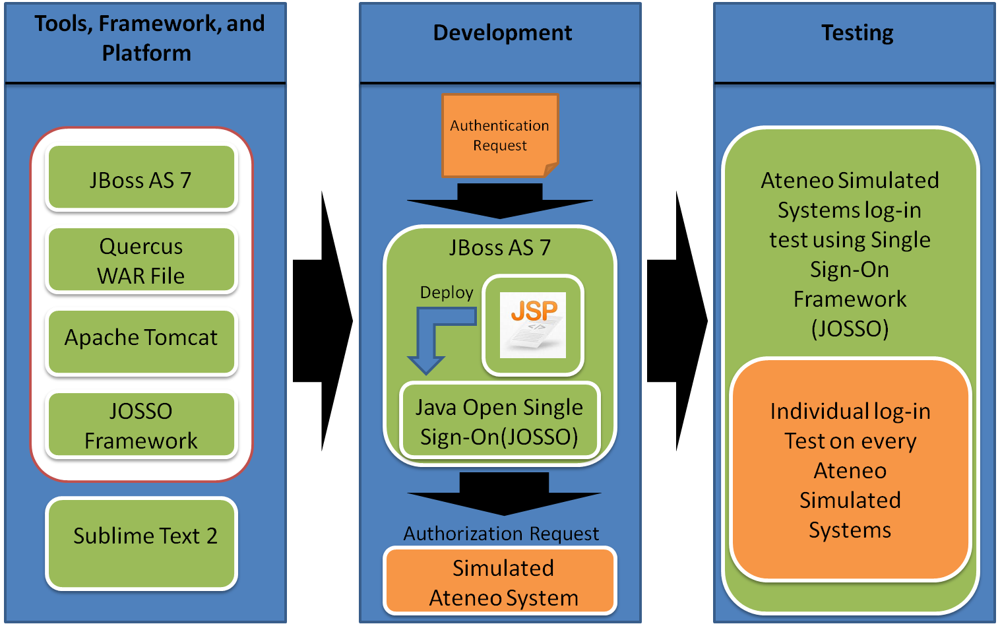
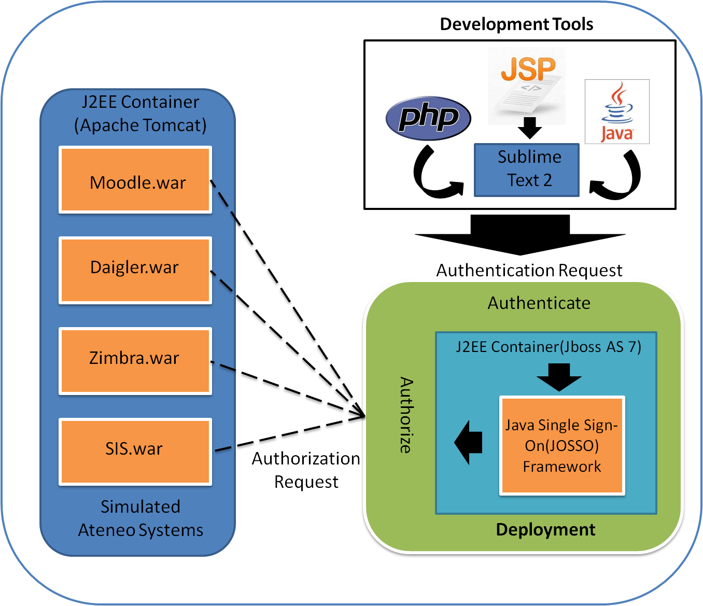
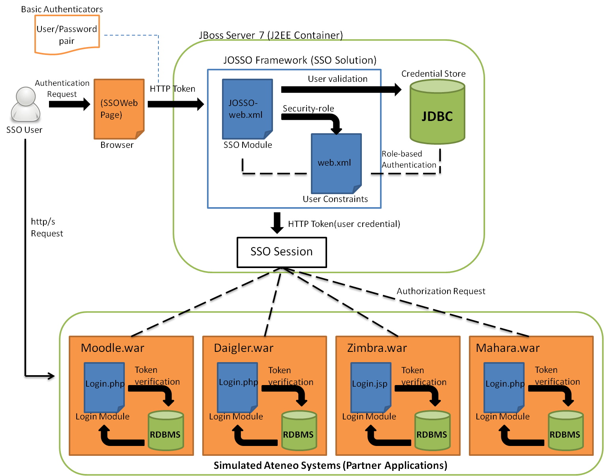
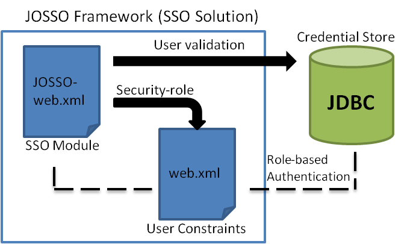
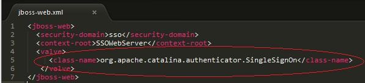
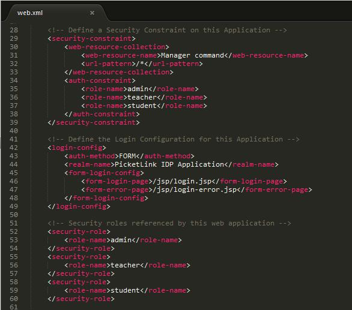

## Project Methodology

 
<figure style="display: flex; justify-content: center;">
	
</figure>
 

The proponents came up with three different phases as the development of the research design area.
These phases are, 1.) Tools, Framework, and Platform selection, 2.) Development phase, and 3.) Evaluation.
In the Tools, Framework, and Platform selection phase, the proponents considered to evaluate and select
different tools to develop and integrate the deployment environment of the project. For the application server
that will serve as a J2EE container of the project, the proponents have considered the following applications
such as JBoss application server, GlassFish server, and Resin Java Application server. These are free and
open source applications having reliable documentations. As reviewed and tested each application, the
proponents decided to use JBoss application server as the J2EE container, in this case JBoss is considered to
be flexible over the other application server. JBoss is written in java and as such is cross-platform: usable on
any operating system that supports java. JBoss server came with more stable versions as the proponents have
evaluated and reviewed the different versions. Each version has its own product features that make JBoss a
unique application server and it also have a well documentation support of the server. Specifically, the
proponents used JBoss AS 7.1, the current stable version where the EE specs were implemented, and this
version was certified for the EE full profile. This version also features an embedded Apache Tomcat 5.5
servlet container which will served as the container for the simulated Ateneo systems. The whole project will
be developed under a WAR file format or a Web Application Archive, it is a JAR file used to distribute a
collection of JavaServer Pages, Java Servlets, Java classes, XML files, tag libraries, static web pages(HTML
and related files) and other resources that together constitute a web application. A WAR file may be digitally
signed in the same way as a JAR file in order to allow to determine what source the code came from. The
proponents also considered using Quercus WAR file as the projects java implementation of PHP released under a Open Source GPL license. Quercus comes with many PHP modules and extensions like MySQL and JSON. Quercus allows for tight integration of java services with PHP scripts, so using PHP with JMS or Grails is a quick endeavor. With Quercus, PHP applications automatically take advantage of java application server features just as connection pooling and clustered sessions. It presents a new mixed Java/PHP approach to web applications and services where Java and PHP tightly integrate with each other.

For the single sign-on solution framework, the proponents have evaluated and reviewed different singlesign-on solutions that can be integrated and deployed thru the simulated Ateneo system such as the Java
Authentication and Authorization System (JAAS), Central Authentication Service (CAS), Java Open Single
Sign-On(JOSSO), and SamL. The proponents have considered the different single sign-on solutions that are
mentioned because of its applicability and flexibility through its deployment such as JAAS, a java
implementation of the standard Pluggable Authentication Module (PAM) information security framework.
Where its main goal is to separate the concerns of user authentication so that they may be managed
independently. By extending the verification vectors, JAAS extends the security architecture for java
applications that require authentication and authorization modules. Same as CAS which is also suitable for a
single sign-on protocol for the web. Its purpose is to permit a user to access multiple applications while
providing their credentials only once. It also allows web applications to authenticate users without gaining
access to a user’s security credentials, such as password. But the proponents have decided to use JOSSO as
the framework for the single sign-on solution for the simulated Ateneo system. It is an open source Java EE
based software for user authentication and authorization. The framework allows multiple web
server/applications such as Apache HTTP Server, Apache Tomcat, JBoss, ASP, PHP etc. to authenticate users
with credential store. JOSSO communicates with credential stores over the Lightweight Directory Access
Protocol (LDAP) or JDBC connection. JOSSO exposes Single Sign-on services using Simple Object Access
Protocol (SOAP) over HTTP protocol allowing it to easily integrate with non-Java applications such as PHP.
Lastly the proponents used sublime text 2 as a source code editor which has a number of unique features that
will help the proponents to develop the application.

 
<figure style="display: flex; justify-content: center;">
	
</figure>
 

The figure above is the birds-eye-view of our single sign-on process using Java Open Single Sign-On
framework. In this stage, the proponents used sublime text as its main development IDE tool, after being
develop, it shall be deployed in the application server, JBoss AS 7 which served as the J2EE container of the
project. It is where the specific process of single sign-on implemented and where the user credentials will be
authenticated. When JOSSO framework receives the user credentials it can be passed in the form of a HTTP
token to the different simulated Ateneo system.
And the final stage of the research design is the testing phase. The proponents conducted an individual
log-in test on every simulated Ateneo system and a simulated Ateneo system log-in test using Single Sign-On
Framework (JOSSO). Where each test phase was evaluated according to its efficiency and accuracy in terms
of its individual login module and according to the Java Open Single Sign-On login module. Each login
module was evaluated on how fast the web applications can be authenticated and resilient on different user
constraints that being deployed in the Single Sign-On framework.

 
<figure style="display: flex; justify-content: center;">
	
</figure>
 

The figure above is the specific and step-by-step process of the authentication and authorization
module using a particular single sign-on framework. The whole process will be explained and will be
illustrated how the Java Open Single Sign-on works as the single sign-on solution through the different
Ateneo simulated systems. First the user request for an authentication of its credentials through a single signon web page. As searched and reviewed by the proponents, there are several types of authentication module
that are potentially to be used, like the basic authentication, strong authentication which involves
certification authority, and windows authentication which heavily rely on physical/hardware authentication.
The proponents decided to use the basic authentication since most or all of the Ateneo systems are
authenticated using basic authentication module. Using the basic authentication, these are only basic
identities of users to authenticate such as username/password pair or an email. But before the user credentials will be validated, it will examined through the JOSSO framework which will be explained further in the next
figure.

 
<figure style="display: flex; justify-content: center;">
	
</figure>
 

The JOSSO framework is designed of a verification vectors which extends the architecture for XMLbased data format that require for single sign-on authentication. When a credential will be given a .xml
component will be triggered.

<figure style="display: flex; justify-content: center;">
	
</figure>

The given code block specifically call the valve class for the single sign-on function which is a built
in function within the Java Open Single Sign-On framework. This function enables the credentials to be
recognize as a global token for all Ateneo simulated systems. Then the user credentials will be validated
through a credential store, the proponents decided to use Java Database Connectivity(JDBC) since the J2EE
container that was used is a java platform and in order for Java programs to execute SQL statements. It also
allows Java programs to interact with any SQL-compliant database which is also at ease for the proponents to
interact to any Ateneo simulated systems backend since the actual Ateneo systems are using SQL-compliant
database. If the user credentials will have a match to its authentication identity from the server database,
security-role will be integrated to every user credentials through the implementation of web.xml file.

<figure style="display: flex; justify-content: center;">
	
</figure>

The proponents have identified three groups of users that can access a particular Ateneo
simulated systems: admin which has the power of student/teacher user creation and deletion, teacher which
can access a particular Ateneo system that are inaccessible for the students, and the student role which also
have its own permission accessibility. The given code block is role-based authentication scheme for every
user credentials that passed through the server database. Every credentials has its own security-role for
constraining its accessibility to some specific Ateneo simulated system that are not supposed to be accessed
by their role. If a specific user cannot be identified to the given role-name it will be automatically bound to
the form-error-page of the server. As for the credentials that are successfully authenticated it will be
encapsulated into a HTTP token that will served as the authenticators during the session. The session will
keep the user credentials and voluntarily push the token to every Ateneo simulated systems. If a user tries to
access an Ateneo simulated systems it will create an authorization request from the current session. So every
Ateneo simulated systems that will be access the user will no need to input his/her credentials. 

