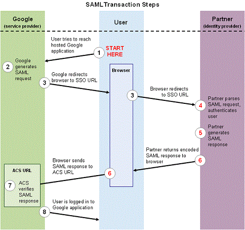
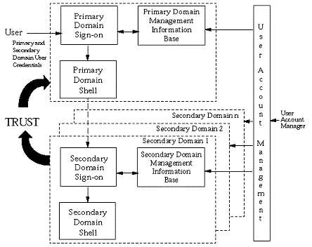
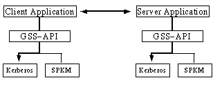

## Review of Related Literature and Technology Application

SSO technology has been a major project to a lot of companies and organizations worldwide. The only
difference from each of them is the framework, and authentication and authorization component. Some
examples that can help the proponents enhance their knowledge on the different ways to use/develop SSO are:

- #### SAML SINGLE SIGN-ON (SSO) SERVICE FOR GOOGLE APPS

SAML stands for Security Assertion Markup Language. In essence, it is an XML-based framework
for asking questions and making assertions about the authentication and authorization of users between
security domains. Google Apps offers a SAML-based Single Sign-on service that provides partner
companies with full control over the authorization and authentication of hosted user accounts that can
access web-based applications such as Gmail or Google Calendar. [Loveland 2002]

<figure style="display: flex; justify-content: center;">
	
</figure>
 

Google’s operational framework shows how it uses SAML in its transactions, which are The user
attempts to reach a Google app, Google then generates a SAML authentication request, Google redirects
the user’s browser, the partner decodes the SAML request and extracts the URL for both Google’s ACS
(Assertion Consumer Service) and the user’s destination URL, the partner generates a SAML response
that contains the authenticated user’s username, the partner then encodes the SAML response and the
RelayState parameter and returns the information to the user’s browser, Google’s ACS verifies the
SAML response using the partner’s public key, and finally the user has been redirected to the
destination URL and logged in to Google Apps
  

- #### LEGACY APPROACH TO USER SIGN-ON TO MULTIPLE SYSTEMS

Historically, a distributed system has been assembled from components that act as independent
security domains. These components comprise individual platforms with associated operating system
and applications. In the single sign-on approach, the system is required to collect from the user, as part
of the primary sign-on, all the identification and user credential information necessary to support the
authentication of the user to each of the secondary domains that the user may potentially require to
interact with. The information supplied by the user is then used by Single Sign-On Services within the
primary domain to support the authentication of the end user to each of the secondary domains with
which the user actually requests to interact. [Maurizio 2008]

<figure style="display: flex; justify-content: center;">
	
</figure>
 

The information supplied by the end-user as part of the Primary Domain Sign-On procedure may be
used in support of secondary domain sign-on in several ways:
- Directly, the information supplied by the user is passed to a secondary domain as part of a
secondary sign-on.
- Indirectly, the information supplied by the user is used to retrieve other user identification
and user credential information stored within the single sign-on management information
base. The retrieved information is then used as the basis for a secondary domain sign-on
operation.
- Immediately, to establish a session with a secondary domain as part of the initial session
establishment. This implies that application clients are automatically invoked and
communications established at the time of the primary sign-on operation.
- Temporarily stored or cached and used at the time a request for the secondary domain
services is made by the end-user.
  

- #### SINGLE SIGN ON THROUGH PASSWORD SYNCHRONIZATION

This paper is a case study on a project to provide an SSO solution to web based applications that
use the mainframe as the data store. Methods that will provide Single Sign On are Kerberos Protocol
and Password Synchronization. This paper should provide guidance to other security professionals faced
with providing a Single Sign On solution. The Single Sign On solution covered is based on password
synchronization. The author of the paper first define the requirements that she would need, next
researched on password synchronization tools and on vendors for SSO products after which told the
vendors that their company had an interest for the products that they were selling and prompted for a
demo and after weighing each product selected a particular needed software/hardware, after which comes customization and testing and lastly, implementation. The data of each test were documented
properly to identify errors and flaws.
  

- #### SINGLE SIGN-ON USING KERBEROS IN JAVA

Kerberos V5 is a trusted third party network authentication protocol designed to provide strong
authentication using secret key cryptography. When using Kerberos V5, the user's password is never
sent across the network, not even in encrypted form, except during Kerberos V5 administration.

<figure style="display: flex; justify-content: center;">
	
</figure>
 

There are mainly two standard security mechanisms that IETF has defined, Kerberos V5 and the
Simple Public Key Mechanism (SPKM). The Generic Security Service API is designed such that an
implementation may support multiple mechanisms simultaneously, giving the application the ability to
choose one at runtime.
   

- #### SHIBBOLETH SSO FOR SMALL BUSINESS

A team of programmers finished making an SSO project in eight weeks by using Shibboleth. The
team used Caveat, which they have said to be “a pretty basic configuration, only one IdP within a single
enterprise,” Shibboleth has been designed to scale out far beyond their implementation (to support SSO
across academic institutions). Shibboleth consists of two main components – an identity provider (IdP)
and SAML v2. The IdP and SP (Service Provider) needs to have knowledge of each other – it is required
for the SP to redirect the user to the IdP for authentication, establish crypto to facilitate message signing
and encryption between the two servers and to define the attributes that can be released from the IdP to
specific SP. The team has successfully invoke Shibboleth SP to talk to their IdP in Canberra after
writing the required SP and IdP metadata.

The aforementioned syntaxes show different protocols on how they deal with the validation of the
user’s login credentials and on how they retrieve credited websites that can be logged in by the specified
applications. Comparing some of these syntaxes, programs, protocols, or applications, with the proposed
project can help enlighten the proponents on the lacking features or the efficiency of use for the SSO
application. [Upadhya et al. ND]
  
