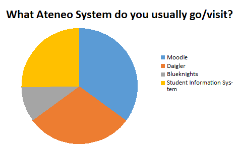
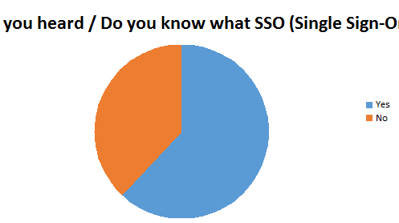

## Results and Discussions

With the increasing use of distributed systems, users often need to access multiple resources to finish a
single business transaction. Users have to login to all of these systems, each of which may involve different
usernames and authentication requirements. The general expected result of this project that will be
implemented in Ateneo systems would be a unique login system which saves the user from repeating his/her
authentication credentials over and over again. By using JOSSO which increases the security features of the
application and extend the verification vectors of authorization and authentication modules.
	
- #### Pre-Test
There were a total of 65 respondents participated in the pre-test survey. The selection of these
participants were not random but through acquaintances, thus the result will not be a representative
group because the participants are not selected randomly. Also, if people were selected randomly, they
usually expect some kind of compensation for participating in the test. This project did not have the
budget to do this.
A total of 59 (about 90.8%) respondents visit Student Information System, 54 (about 87.7%) of the
respondents visit Moodle, 46 (about 70.8%) respondents visit Daigler, and 15 (about 23.1%)
respondents visit Blueknights. These respondents were not limited to choose only one (1) Ateneo
system, but were able to choose all of the Ateneo system mentioned. These respondents are Ateneo
students and about three (3) teachers.

<figure style="display: flex; justify-content: center;">
	
</figure>
  

Out of the 65 respondents, 21 remained to answer a couple more questions concerning the SSO.
Particularly, on the next question, if the respondents know what SSO is, a total of 21 respondents, 13
(about 61.9%) said yes, and 8 (about 38.1%) said no. Based on the results of the survey, even though
SSO is popular and widely used, only few know what it really is or even know the fact that what they
are already using is already SSO.

<figure style="display: flex; justify-content: center;">
	
</figure>
  

Among the respondents, all of them have seen/tried various applications that uses SSO, but didn’t
know that it was already SSO that they were using. The most common of which was Facebook’s “Login
using/with Facebook” button that is located on a lot of different applications and websites.

- #### Post-Test
There are a total of 21 respondents who answered the post-test survey questions. These questions
mainly asked on the SSO’s usability, convenience, and security. The first question is that of which the
reason why the project is being conducted in the first place; the feedback if SSO would be implemented
on the schools’ systems. 
  
|| very bad | bad | average | good | very good |
| :---: | :---: | :---: | :---: | :---: | :---: |
| What is your impression of an SSO app being deployed in Ateneo academic information system? | 0 | 1 | 6 | 4 | 9 |
  
The result of the survey question: if the application would be deployed/implemented in the school.
The highest being Very Good, giving the impression that this application would help these respondents
in accessing the different school systems. Though the number of respondents may be quite small and
that it represents only a fraction of the majority of the whole student body, it would be safe to assume
that only a few would vote for bad, seeing that today’s generation seeks efficiency and accuracy.
  
| Questions | Yes | No |
| :---: | :---: | :---:|
| Does SSO efficiently decrease your time in switching from different Ateneo Systems? | 20 | 1|
| Would you be able to use this application on a daily basis? | 16 | 5 |
| Do you like having/inputting your password only in a single site? | 17 | 4 |
| Do you worry about the security aspect of the application? | 16 | 5 |
| Does a SSO application help you manage your passwords? | 15 | 6 |
| Do you think the SSO application can increase your security? | 10 | 11 |
  
Based on the results on Table 2, the respondents gave SSO quite a good feedback with more yes
than no, except for the security question. It has always been a debate if whether SSO can truly improve
the security of their accounts under a single global credential. This is where one of the major concerns
of SSO comes in, the security feature. Although this project is not focusing on the security issues of the
developed SSO, it is still one of the questions any normal person would ask themselves, if having the
same user credentials to multiple user accounts would be safe. SSO comes with different encrypting
algorithm that mostly depends on the language that is being used, most of which are readily available
but can still be improved. Aside from Table 2, the proponents also asked the respondents regarding their
concern on the SSO, and some of their feedbacks were, “Security of passwords”, “usability”, “Security;
a single password for multiple linked accounts. Once a password is hacked, all accounts can be access.
But then again, why store personal data on a school system? :D”, and lastly a surprising response of
“How will it be implemented in the Ateneo Sites? Will it be allowed?” This particular question may be
concerned on if it would be the same as Facebook’s “Sign in using Facebook” option. Out from all of
the feedback, it all comes down to how secure can an SSO get, or how can SSO guarantee the safety of
the passwords.

